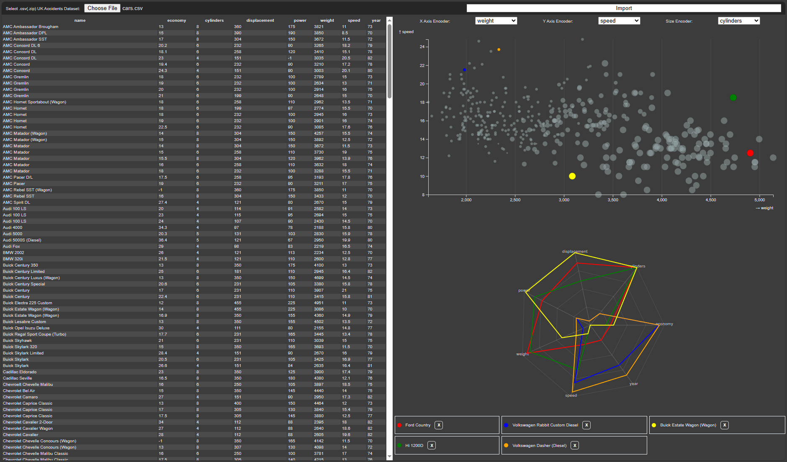

# First Exercise Implementation

This is late attempt at implementing the first task of data visualization exercise. All required functionalities are implemented except:

1. Animation transitions (due to extremely frustrating errors)

There are some issues when update is called during selection (e.g., some elements are selected in the scatterplot and resize happens).

## Usage

Open `dist/first_exercise.html` file (or generate it yourself using: `npm i && npm run build`):

1. select the cars dataset in `dist/cars.csv` (I assume we can choose any one of the 3 provided datasets)
2. click on the import button
3. click on scatterplot dots to update legend and radar visualization